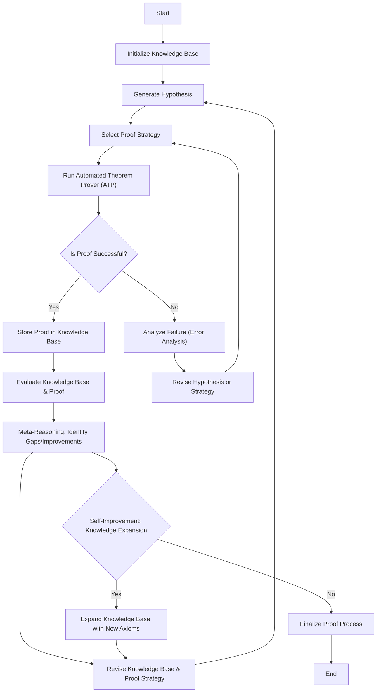

# CMM-LEN Logic Evaluation Network

Automatically full autonom proving network.

## Example

### Scenario: Fruit Inventory

We have one Environment called "World" containing two types of fruit instances:

- **Apples**: We have 5 apples and all of them are red
- **Pears**: We have 3 pears - 2 are green and 1 is yellow
 - **Basket**: A container instance used to demonstrate instance-to-instance relationships

### Object Structure

```
World (Environment)
├── Apple (Instance)
│   ├── count = 5
│   └── color = red
│   └── container = Basket (Instance)
└── Pear (Instance)
    ├── count = 3
    ├── Pear 1 (Subgroup)
    │   ├── count = 2
    │   └── color = green
    └── Pear 2 (Subgroup) = 1
        ├── = 2
        └── color = yellow

Relationships
- Apple ↔ Pear
```

### Explanation

**Environment "World"**: This is the top-level container that groups all fruit-related objects under a single logical scope.

**Instance "Apple"**: Represents the apple entity within the World environment. When created, it automatically links itself to the World environment. The Apple instance has two properties:
- Property `count` with value `5` - indicating there are 5 apples
- Property `color` with value `red` - indicating all apples are red

**Instance "Pear"**: Represents the pear entity within the World environment. It automatically links itself to the World environment. The Pear instance has a total `count = 3` and is shown with two subgroups to reflect the color split:
- **Pear 1 (Subgroup)**: `count = 2`, `color = green`
- **Pear 2 (Subgroup)**: `count = 1`, `color = yellow`

This subgroup view keeps the Pears under one instance while still expressing that the 3 pears are divided by color.

**Instance "Basket"**: Demonstrates that an instance can be used as a property value of another instance. Here, Apple has the property `container = Basket`.

**Relationships**: Instances can also have explicit relationships with each other (e.g., `Apple ↔ Pear`) to represent semantic links beyond properties.

### Key Insights

The Pear instance demonstrates how related but distinct objects can be grouped together within the same scope. Although the 2 green pears and 1 yellow pear are separate items, they all belong to the same Pear instance because they share the same meaning/category within the World environment.

Each object (Environment, Instance, and Property) has a unique ID for tracking and retrieval, enabling relationship management and data consistency.

### Logic and Evaluation

How should an AI

## Difference between Subgroups and Inherite Instances
Subgroups. Same Instances. Like dogs from different races
Inherite Instances in a Instance. Like a apple in a basket

# Relationship


# Flow Chart for Reasoning and Proving Statements
RPSTN (Reasoning and Porivng Statement Network).



Through the use of different well-known well-built frameworks / engine we can build on top of this and create a more complex autonom reasonsing and proving engine.

### How Humans Prove Things

See [PDF of University of Münster](https://hal.science/hal-03746866v1/file/TWG01_16_Kirsten.pdf)

## How to proof a statement in real life (linguistical)

> Apples are red

We know for sure that apples are red. But how do we show and display a proof that apples are red? It is "all" apples are red or it is "some" apples are red. From a linguistic point of view, language is much more difficult to prove than pure mathematics. Language is much more versatile in its meaning and one statement may have multiple answer and results.

So we have to convert the linguistical meaning into mathematical meaning. Now it is either $\exists \text{Apple}.\text{color} = \text{red}$ or $\forall \text{Apple}.\text{color} = \text{red}$. The color is a property of the instance Apple.

$$ (\forall \text{I}.\text{p} = \text{v} \lor \exists \text{I}.\text{p} = \text{v}) \oplus (\forall \text{I}.\text{p} = \text{v} \oplus \exists \text{I}.\text{p} = \text{v}) $$

To prove either of them, we can use multiple kinds of methods. We're going to use the direct prove through knowledge. We know that Apples can be *red* but also there are Apples that are *green* or *brown*.

So the first statement is correct but the second is not. So Language is not the best method to be used for a statement without concrete or narrowed domain in which we can then prove.

## How to proof a statement in real life (mathematical)

$$ \text{If}\space k \in \mathbb{Z}, \text{then}\space\{n \in \mathbb{Z} : n|k\}⊆\{n \in \mathbb{Z} : n|k^2\} $$

We can split this statement into two pieces. One the effect and one the instances of the effect. 

- Instances: $k \in \mathbb{Z}$
- Effect: $\{n \in \mathbb{Z} : n|k\}⊆\{n \in \mathbb{Z} : n|k^2\}$

Those statements in the statement again can be splitted again into instances and effect.

- Instances of Stmt 1: $n \in \mathbb{Z}$
- Effect of Stmt 1: $n|k$

The inference engine can see that $n$ is divisble by $k$. So from the database we can say that $k = m \cdot n$ where all are in the $\mathbb{Z}$ domain. This is an already proven rule / axiom with an entry like:

$$ E: [v_1 | v_2]; S : [v_2 = a_r v_1] ; D : [op~slm[op~d~v_1 \lor op~d~v_2]] $$
or
$$ E: [v_1 | v_2]; S : [v_2 / a_r \equiv 0 \mod v_1] ; D : ... $$

slm stands for set level max. N is smaller then Z so Z is chosen as domain. Op d meaing, getting the domain of the variable.

